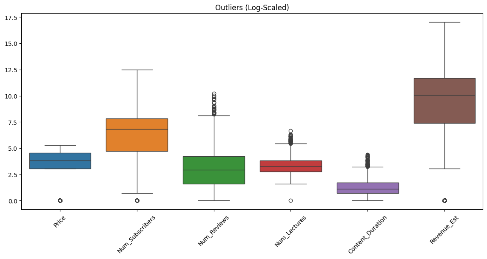
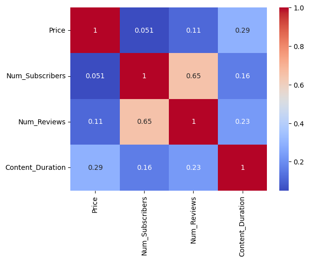

# Udemy Online Courses – Exploratory Data Analysis
Exploratory Data Analysis of Udemy courses dataset using Python

## Overview
This project performs an end-to-end Exploratory Data Analysis (EDA) on Udemy’s online course dataset to uncover insights related to pricing strategy, subscriber behavior, content patterns, and revenue drivers.

The goal is to understand:
- What makes a course successful
- How pricing affects demand
- Which subjects generate maximum revenue
- How engagement metrics correlate with monetization

---

## Dataset
Source: Kaggle  
Link: https://www.kaggle.com/datasets/andrewmvd/udemy-courses

The dataset contains information about:
- Course title and subject
- Pricing and payment type
- Number of subscribers
- Number of reviews
- Content duration
- Course level
- Publication timestamp

---

## Tools & Technologies
- Python
- Pandas
- NumPy
- Matplotlib
- Seaborn
- Jupyter Notebook

---

## Key Steps Performed

### 1. Data Cleaning
- Removed duplicate records  
- Handled missing values  
- Converted timestamp to datetime  
- Created derived features (year, month, estimated revenue)  
- Removed non-analytical identifier columns (URL, course ID)

### 2. Feature Engineering
- Estimated revenue = price × subscribers  
- Converted boolean flags to categorical labels  
- Extracted temporal features

### 3. Outlier Analysis
- Global boxplot for all numerical features  
- Log-scaled distributions to handle heavy-tailed data  
- Retained extreme values as they represent real business phenomena

### 4. Statistical & Visual Analysis
- Pricing vs subscriber acquisition  
- Revenue distribution by subject  
- Engagement metrics vs monetization  
- Market saturation across categories  
- Growth trends over time  

---

## Sample Insights

### Outlier Detection


Outlier analysis revealed strong right-skewed distributions in subscriber count, reviews, content duration, and revenue, consistent with power-law behavior commonly observed in digital platforms.

---

### Price vs Subscribers


Higher priced courses tend to attract fewer users but generate higher per-course revenue.

---

### Correlation Heatmap


Number of reviews is the strongest predictor of revenue.

---

## Key Conclusions
- The platform follows a power-law distribution: few courses generate most revenue.
- Engagement metrics (reviews) are more predictive than price.
- Free courses act as acquisition funnels.
- Course duration has diminishing returns beyond a threshold.

---

## How to Run
```bash
pip install -r requirements.txt
jupyter notebook
